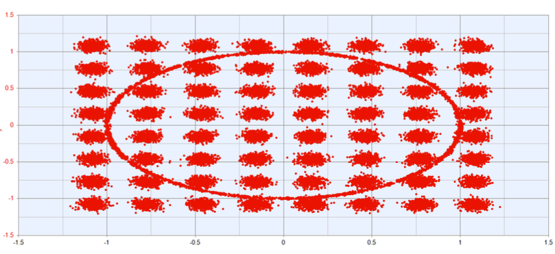
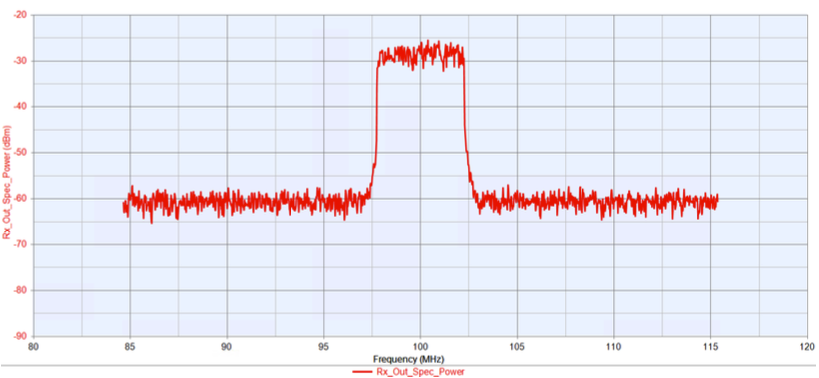
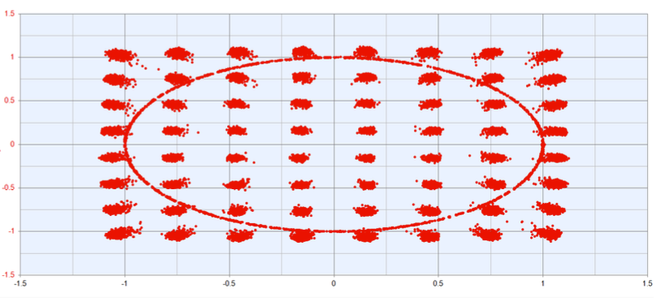
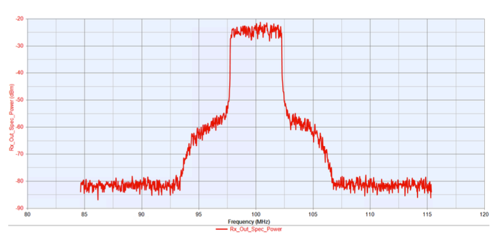
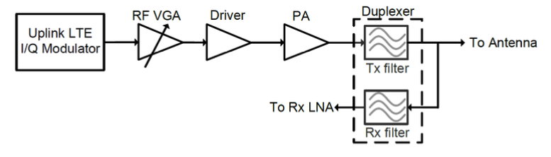
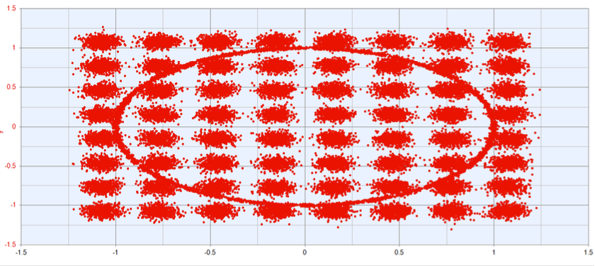
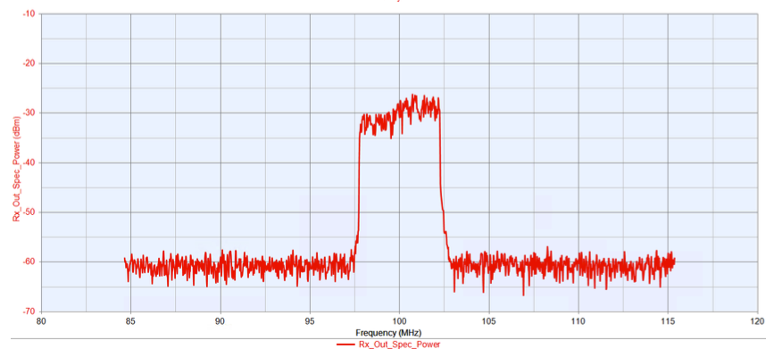
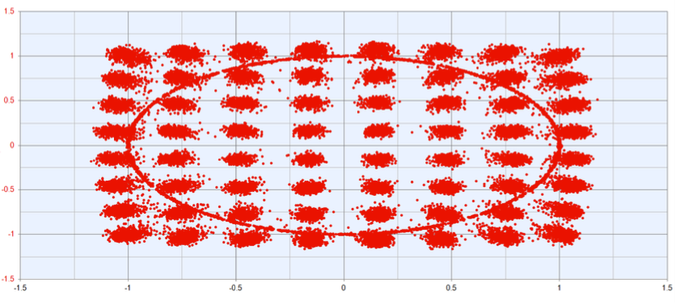
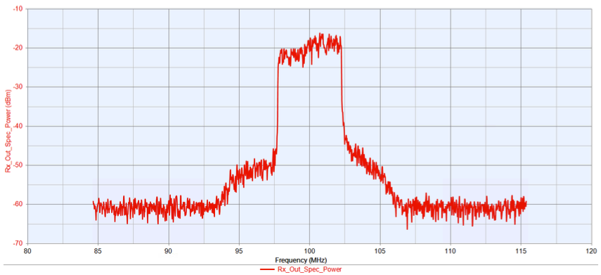

# LTE RF Uplink
## Design and Analysis of LTE transceiver link using SystemVue simulation engine
- [LTE RF Uplink](#lte-rf-uplink)
  - [Design and Analysis of LTE transceiver link using SystemVue simulation engine](#design-and-analysis-of-lte-transceiver-link-using-systemvue-simulation-engine)
  - [Overview](#overview)
    - [Project Characteristics](#project-characteristics)
    - [System Requirements](#system-requirements)
  - [Base Station Receiver Design](#base-station-receiver-design)
    - [Front End Block Diagram](#front-end-block-diagram)
    - [Rx Characteristics](#rx-characteristics)
    - [Components](#components)
    - [Design](#design)
    - [Simulations](#simulations)
  - [Mobile Transmitter Design](#mobile-transmitter-design)
    - [Front End Block Diagram](#front-end-block-diagram-1)
    - [Uplink Channel Modelling](#uplink-channel-modelling)
    - [Tx Characteristics](#tx-characteristics)
    - [Components](#components-1)
    - [Design](#design-1)
    - [Simulations](#simulations-1)

## Overview
This project involves modelling a LTE RF uplink using SystemVue simulation. This includes the design of the mobile device transmitter and base station receiver as well as modelling the uplink channel path loss.
### Project Characteristics
- **Operating Frequency:** 1.95 GHz
- **Channel Bandwidth:** 5 MHz
- **Duplex Model:** FDD
- **Link Distance:** 100m
- **Modulation Type:** 64 QAM
### System Requirements
- **EVM:** <6%
- **Rx Dynamic Range:** >40dB
- **Rx Sensitivity:** -70dBm

## Base Station Receiver Design
### Front End Block Diagram

### Rx Characteristics
- **Rx Frequency:** 1.95 GHz
- **IF Frequency:** 100 MHz
- **IF Output Power:** -5 dBm
- **Antenna Noise Temperature:** 270K
  
### Components
- **Duplexor Filter**
  - 5th order Butterworth Band Pass Filter with Insertion Loss of 1dB
- **LNA** 
  - Design Variables: Noise Figure(NF), Gain, IIP3
- **Mixer** 
  - Design Variables: NF, Conversion Gain, IIP3
- **Voltage Controlled Oscillator(VCO)**
  - Design Variables: Phase noise
- **IF Variable Gain Amplifier(VGA)** 
  - AD8367 from Analog Devices
  - Parameters taken from datasheet
  - Operates in two states: lower power mode and high power mode
  - Design Variables: NF, Gain, IIP3

### Design
1. Initial System Model
     - Developed equations to relate individual component parameters (e.g., gain, noise figure, linearity) to overall receiver system requirements.
     - Derived relationships such as cascaded noise figure (using Friis' formula) and system gain to ensure the design met key performance metrics like sensitivity and dynamic range.
2. Optimizing FOM using MATLAB
   - Introduced FOM equations to increase practicality of component design
   - Utilized MATLAB optimization functions to determine component parameters that meet system requirements while minimizing FOM
3. Final Simulations in SystemVue
   - Simulated Rx performance in SystemVue and tuned parameters to meet requirements
   - Validated design meets system requirements

**Final Parameters**
- LNA
  - NF: 1.5dB
  - Gain: 16dB
  - IIP3: 0dBm
- Mixer
  - NF: 14dB
  - Conversion Gain: 10dB
  - IIP3: 13dBm
- VCO
  - Phase Noise (100kHz): -95dBc/Hz
- IF VGA
  - NF Lower: 9.5dB
  - NF Upper: 44.5dB
  - Gain Lower: 40.2dB
  - Gain Upper: 5dB
  - IIP3 Lower: 33dBm
  - IIP3 Upper: 34dBm

### Simulations
**Rx Output at min sensitivity**
*Pin = -70dBm*

*Measurements*
- **Output Power:** -4.84 dBm
- **EVM:** 4.683%
- **ACPR:** -31.56dB
- **PAPR:** 7.053dB
  
*Constellation*

*Spectrum*

**Rx Output at high end of dynamic range**
*Pin = -30dBm*

*Measurements*
- **Output Power:** -0.684 dBm
- **EVM:** 3.385%
- **ACPR:** -37.42dB
- **PAPR:** 5.472dB
  
*Constellation*

*Spectrum*

## Mobile Transmitter Design
### Front End Block Diagram

### Uplink Channel Modelling
The uplink channel path loss was modelled using the CommsChannel block in SystemVue.
### Tx Characteristics
- **Rx Frequency:** 1.95 GHz
- **Tx Power Control:** +10dB
- **Modulator Output Power:** -10dBm
### Components
- **Duplexor Filter**
  - 5th order Butterworth Band Pass Filter with Insertion Loss of 1.5dB
- **LTE Modulator**
  - I/Q Modulator with output power of -10dBm, gain imbalance of 0.2dB and phase imbalance of 0.5 degrees
- **PA** 
  - Design Variables: NF, Gain, OIP3
- **Driver** 
  - Design Variables: NF, Gain, OIP3
- **RF VGA** 
  - Design Variables: NF, Gain, OIP3
### Design
1. Initial System Model
     - Similar to the Rx model we developed equations to relate individual component parameters (e.g., gain, noise figure, linearity) to overall receiver system requirements and to make sure each component operated linearly
2. Final Simulations in SystemVue
   - Simulated overall system performance in SystemVue(Tx, Channel Loss and Rx) and tuned parameters to meet requirements from Tx input to Rx output
   - Validated design meets system requirements
### Simulations
**Rx Output at min sensitivity**
*Tx Pout = ~19.5dBm*

*Measurements*
- **Output Power:** -4.84 dBm
- **EVM:** 5.907%
- **ACPR:** -30.2dB
- **PAPR:** 6.649dB
  
*Constellation*

*Spectrum*

**Rx Output at high end of dynamic range**
*Tx Pout = ~29.5dBm*

*Measurements*
**At Rx Out**
- **EVM:** 5.884%
- **ACPR:** -32.76dB
- **PAPR:** 5.075dB
  

*Constellation*

*Spectrum*
